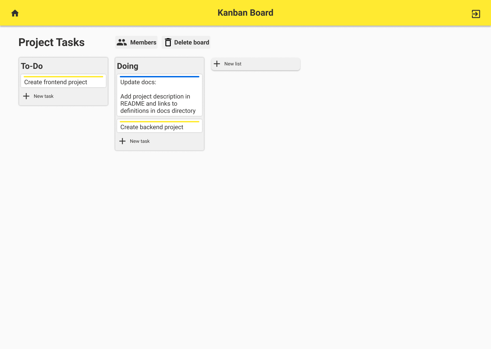

# Kanban Board

Kanban board application to help organize and manage tasks.

A live demo is available [here](https://kanban-board-web.web.app/), you can also access the [web API docs](https://api-kanban-board.herokuapp.com/docs).



<p align="center">
 <a href="#why">Why?</a> •
 <a href="#technologies">Technologies</a> •
 <a href="#getting-started">Getting started</a> •
 <a href="#contact">Contact</a> •
 <a href="#license">License</a>
</p>

## Why?

This application was built with the purpose of learning
[ASP.NET Core](https://docs.microsoft.com/en-us/aspnet/core/?view=aspnetcore-3.1)
and [ReactJS](https://reactjs.org/) going through the planing, management,
coding and deploying phases.

## Technologies

-   Backend
    -   [ASP NET Core](https://docs.microsoft.com/en-us/aspnet/core/?view=aspnetcore-3.1):
        Cross-platform framework to build web apps
    -   [PostgreSQL](https://www.postgresql.org/): Open Source Relational
        Database
    -   [Dapper](https://dapper-tutorial.net/dapper): Micro ORM
    -   [FluentValidation](https://fluentvalidation.net/): A popular .NET library for building strongly-typed validation rules
    -   [Morcatko.AspNetCore.JsonMergePatch](https://github.com/Morcatko/Morcatko.AspNetCore.JsonMergePatch): JsonMergePatch support for ASP.NET Core
    -   [FluentMigrator](https://github.com/fluentmigrator/fluentmigrator): Migration framework for .NET
-   Frontend
    -   [ReactJS](https://reactjs.org/): JavaScript library for building user
        interfaces
    -   [Typescript](https://www.typescriptlang.org/): Typed superset of
        JavaScript
    -   [styled-components](https://styled-components.com/): Stylization library to React
    -   [react-router-dom](https://reacttraining.com/react-router/web/guides/quick-start): Declarative routing for React
-   [Heroku](https://www.heroku.com/): Heroku is a platform as a service (PaaS) that enables developers to build, run, and operate applications entirely in the cloud
-   [Firebase](https://firebase.google.com/): A comprehensive app
    development platform

# Getting started

### Clone

Clone this repository

```
git clone https://github.com/fernandovmp/kanban-board
```

Then, change to repository folder

```
cd kanban-board
```

## How to run

### Run with docker

Requires

-   [Docker](https://docs.docker.com/get-docker/)
-   [Docker Compose](https://docs.docker.com/compose/install/)

Run the following command to start database, backend and frontend

```
docker-compose up -d
```

ASP.NET Core API will be available in `http://localhost:5000`
ReactJS app will be available in `http://localhost:3000`

To stop the application run

```
docker-compose down
```

### Run without docker

Requires

-   [.NET Core 3.1 SDK](https://dotnet.microsoft.com/download)
-   [NodeJS](https://nodejs.org/en/)
-   [Yarn](https://yarnpkg.com/)

**Back-end**

Restore all dependencies running

```
dotnet restore
```

Build the solution

```
dotnet build
```

To run the tests of all dotnet projects execute

```
dotnet test --filter TestType!=Integration
```

And run the web API project with the following command.

```
dotnet run --project src/KanbanBoard.WebApi
```

**Front-end**

Install the dependencies by running

```
yarn --cwd src/KanbanBoard.Frontend
```

Then, start the project

```
yarn --cwd src/KanbanBoard.Frontend start
```

### Documentation

In the [docs](./docs) directory you can find the the users histories, the Web
API specification, the database model and the UI prototype for this project,
this will give you a good idea of what expect of the project.

## Contributing

Contribution of any kind is appreciated!

Some ways you can contribute with the project are by open an issue with bug
report, giving a suggestion or open a pull request.

To see the details of how contribute refer to the
[Contribution Guide](.github/contributing.md).

## Contact

If you want to contact me, you can do it in the following channels:

[](mailto:fernandovmp@outlook.com)
[](https://www.linkedin.com/in/fernandovmp/)

## License

This repository is under the [MIT](./LICENSE) license.
